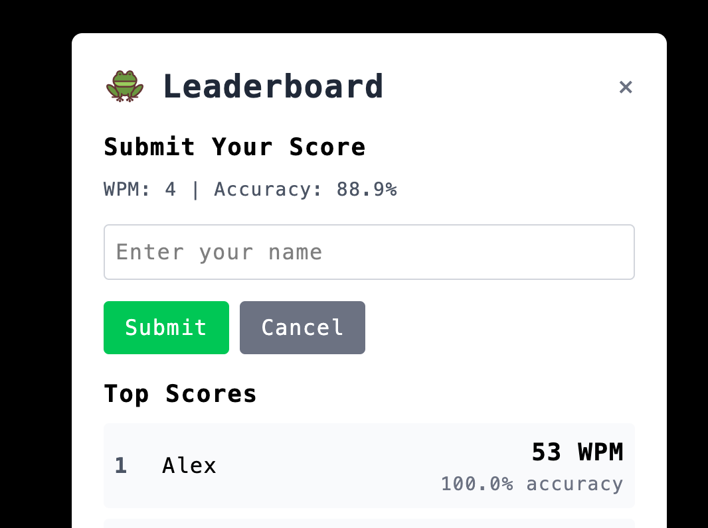

# TypeLeap 🐸

A modern typing speed test built with React and TypeScript. Test your WPM, compete on the leaderboard, and watch a frog hop across the screen as you type.


## Features

- **Real-time typing test** with 30-second timer
- **WPM calculation** and accuracy tracking  
- **Global leaderboard** with Firebase integration
- **Animated frog** that hops with joy (or sadness)
- **Educational content** about typing benefits
- **Responsive design** that works on all devices

### Leaderboard


### Educational Content


## Stack

- React 18 + TypeScript
- Vite for build tooling
- Tailwind CSS for styling
- Firebase Firestore for leaderboard
- Framer Motion for animations

## Getting Started

### Prerequisites

- Node.js 16+ 
- npm or yarn

### Installation

```bash
# Clone the repo
git clone https://github.com/AlexanderLasson/typeLeap.git
cd typeLeap

# Install dependencies
npm install

# Start development server
npm run dev
```

### Firebase Setup

1. Create a Firebase project at [console.firebase.google.com](https://console.firebase.google.com)
2. Enable Firestore Database
3. Update `src/config/firebase.ts` with your project config
4. Set Firestore rules to allow read/write for development

### How to Play

1. Type the words as they appear
2. Complete the 30-second test
3. View your WPM and accuracy results
4. Submit your score to the leaderboard


### Built for the 2025 CACI Game Jame 🎮
